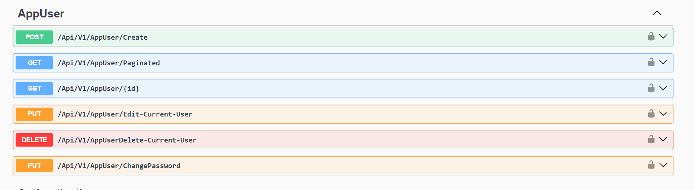
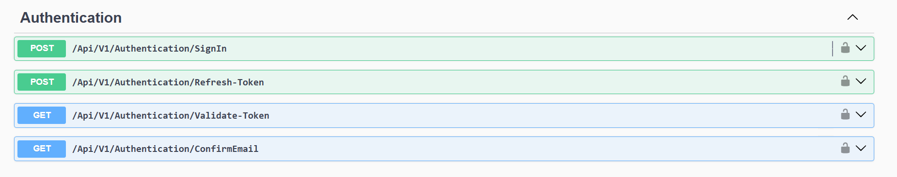
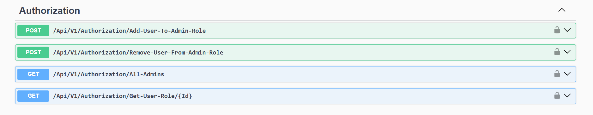
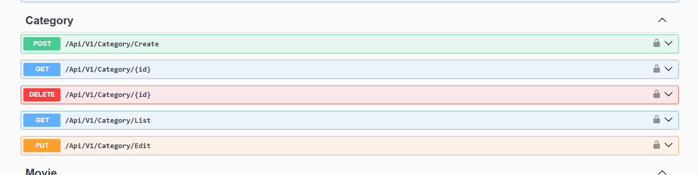
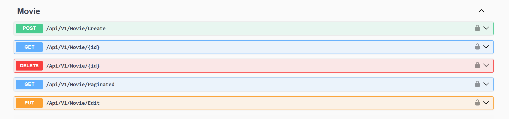
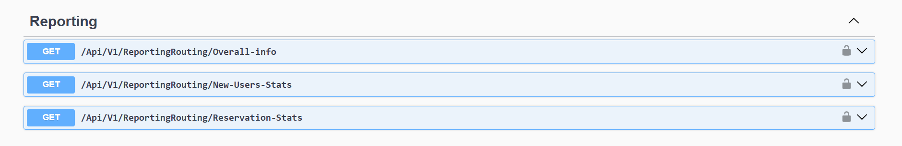
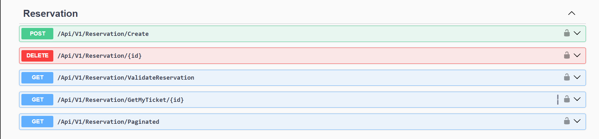
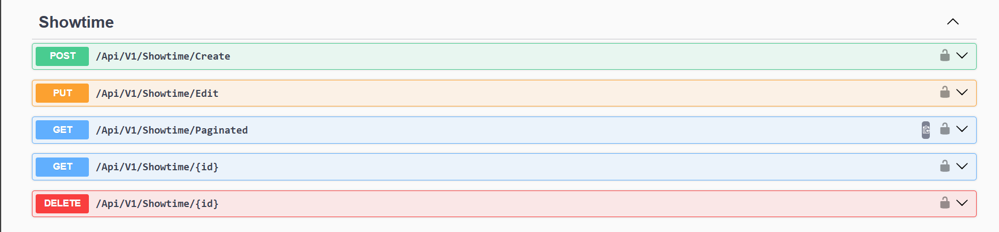

## 🎬 Movie Reservation System

A backend API system built with **ASP.NET Core** using **Clean Architecture** to manage movie ticket reservations. The system includes features like **user authentication and authorization**, **movie and showtime management**, **seat reservations**, and **reservation reporting**.

> 💡 This project is based on the [Movie Reservation System](https://roadmap.sh/projects/movie-reservation-system) idea from roadmap.sh, adapted and extended to follow best practices and a modular architecture suitable for real-world applications.

---

## 🏗️ Tech Stack

- **Language**: C#  
- **Framework**: ASP.NET Core Web API  
- **Database**: SQL Server (SSMS)  
- **Architecture**: Clean Architecture  
- **Authentication**: ASP.NET Identity + JWT (Access & Refresh Tokens)  
- **Authorization**: Role-based  
- **Email**: SMTP integration  
- **File Upload**: Image service  
- **Logging**: Custom logging setup  

---

## ✅ Features

- **User Roles**: Admin & Regular Users
- **Movie & Showtime Management**
- **Seat Reservation with Overbooking Prevention**
- **Authentication & Token Refresh**
- **Authorization with Roles**
- **Pagination Support**
- **CRUD Operations**
- **Data Seeder**
- **Image Upload Support**
- **Logging Mechanism**
- **Account Confirmation via Email**
- **User Registration/Login with JWT**
- **Reservation Reporting for Admins**

---

## 🧠 Design Patterns & Libraries Used

- ✅ **Clean Architecture**
- ✅ **Mediator Pattern** (via MediatR)
- ✅ **AutoMapper** with Partial Classes
- ✅ **Response Wrapper** & **Handler**
- ✅ **Generic Repository Pattern**
- ✅ **FluentValidation** for request validation
- ✅ **Error Handler Middleware**
- ✅ **Pagination Schema**
- ✅ **ASP.NET Identity** for user management
- ✅ **JWT Token + Refresh Token**
- ✅ **Email Sending Service**
- ✅ **Image Upload Service**

---

## 🔐 Authentication & Authorization

- JWT tokens are used for authenticating users.
- Refresh Tokens implemented for session continuity.
- Role-based Authorization:
  - **Admin**: Manage movies, showtimes, and reports.
  - **User**: Browse and reserve showtimes.

---

## 📦 API Endpoints 

### AppUser


### Authentication


### Authentication


### Category


### Movie


### Reporting


### Reservation


### Reservation


### Theater


---

## 🗂️ Folder Structure (Clean Architecture)

```
/MovieReservation.Api
    ├── Base
    ├── Controllers
    ├── appsettings.json
    └── Program.cs

/MovieReservation.Core
    ├── Bases
    ├── Behaviors
    ├── Features
    ├── Mapping
    ├── Middleware
    ├── Wrappers
    └── ModuleCoreDependencies.cs

/MovieReservation.Data
    ├── Entities
    ├── Enums
    ├── Helpers
    ├── Results
    └── Routing

/MovieReservation.Infrastructure
    ├── Abstracts
    ├── Context
    ├── GenericRepository
    ├── Migrations
    ├── Repositories
    ├── Seeder
    ├── ModuleInfrastructureDependencies.cs
    └── ServiceRegistration.cs

/MovieReservation.Service
    ├── Abstracts
    ├── Implementations
    └── ModuleServiceDependencies.cs

```

---

## 🚀 Getting Started

1. Clone the repo:
   ```bash
   git clone https://github.com/ahmedsamy56/MovieReservation.git
   ```
2. Setup the DB via SSMS (SQL Server)
3. Configure `appsettings.json`:
   - JWT secret
   - SMTP config
   - Connection string
4. Run the project:

   ```bash
   dotnet run
   ```

---

